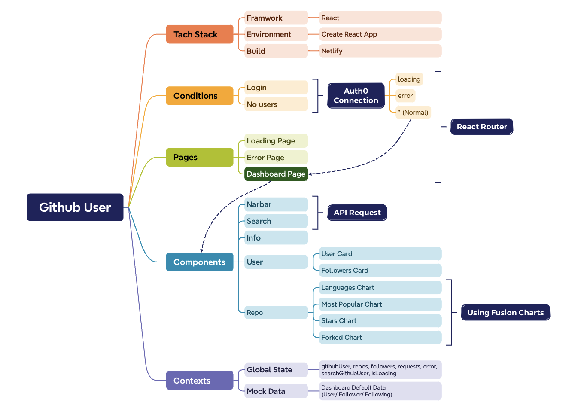

## Project Review

### Tach Stack
Technologies: JavaScript, React, HTML, CSS, Auth0, GitHub API, 

### Introduce
Craft a dynamic and responsive site for GitHub user search and data presentation. (including name, image, following and repos data)

- Implemented Auth0 for secure third-party authentication, seamlessly connecting with GitHub API for data retrieval.
- Enhanced user data visualization using Fusion Charts.
- Optimized navigation with React Router for a smooth overall user experience.

### Testing Case

@sarah_edo 
@john_smilga  
@cassidoo 

## Other Info

### Gihthub API
- [Root Endpoint](https://api.github.com)
- [Get User](https://api.github.com/users/wesbos)
- [Repos](https://api.github.com/users/john-smilga/repos?per_page=100)
- [Followers](https://api.github.com/users/john-smilga/followers)
- [Rate Limit](https://api.github.com/rate_limit)

  For unauthenticated requests, the rate limit allows for up to 60 requests per hour. 
  Unauthenticated requests are associated with the originating IP address, and not the user making requests.

### Fusion Charts
- [Fusion Charts - Main Docs](https://www.fusioncharts.com/)
- [First React Chart](https://www.fusioncharts.com/dev/getting-started/react/your-first-chart-using-react)
- [List Of Charts](https://www.fusioncharts.com/dev/chart-guide/list-of-charts)
- [Themes](https://www.fusioncharts.com/dev/themes/introduction-to-themes)

### Auth0
- [Auth0 - Main Docs](https://auth0.com/)
- Connections
  email, linkedln, google

- [React SDK Docs](https://auth0.com/docs/libraries/auth0-react)
- [REACT SDK API Docs](https://auth0.github.io/auth0-react/)

### Deployment
[Netlify](https://www.netlify.com/)
